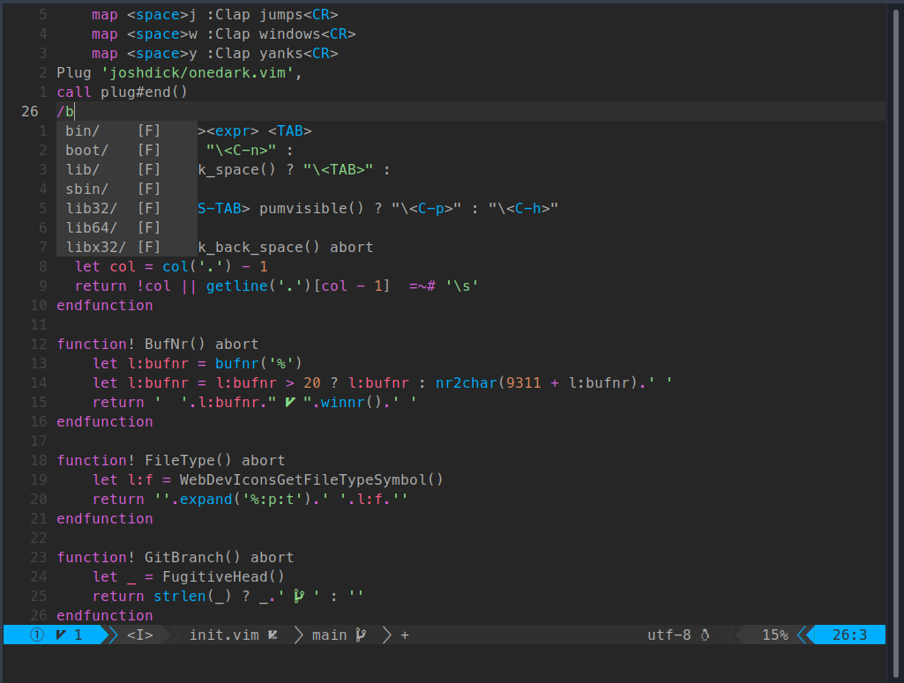

# Neovim config


My neovim config.
To use it make sure to have the requirements from all plugins, such as nodejs which is required to use coc; and install vim-plug to manage the plugins.
`https://deb.nodesource.com/setup_16.x` is a useful script to install node version 16.
```
curl -fsSL https://deb.nodesource.com/setup_16.x | sudo -E bash -
sudo apt install -y nodejs
```
For ubuntu-like distros.

## Installation
### Install  vim-plug
```
sh -c 'curl -fLo "${XDG_DATA_HOME:-$HOME/.local/share}"/nvim/site/autoload/plug.vim --create-dirs \
       https://raw.githubusercontent.com/junegunn/vim-plug/master/plug.vim'

```

### Clone repository in .config folder
`git clone git@github.com:TorioCrema/nvim-config.git ~/.config/nvim`

### Install plugins with vim-plug
Open nvim and run the following command: `:PlugInstall`

All default coc plugins will install automatically.
